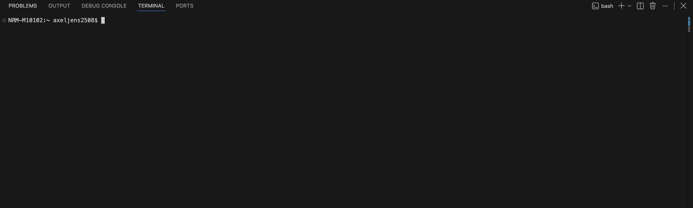

# Introduction to bash and slurm

This is a small introduction to get started with bash and slurm, specifically aimed at users of the PDC cluster dardel (which is our main cluster at the Swedish museum of natural history). The goal is to introduce the basics for navigating around computers with the bash terminal, which is how we're typically interactive with the cluster, and how to submit jobs to the compute knows which are managed by slurm.

## Contents

- [Bash](#bash)
- [Writing scripts](#writing-scripts)
- [For-loops](#for-loops)
- [While-read loops](#while-read-loops)
- [Piping commands](#piping-commands)
- [Signing in to Dardel](#signing-in-to-dardel)
- [Software modules](#software-modules)
- [Submitting Slurm jobs](#submitting-slurm-jobs)

This page is structured like a small GitHub wiki index: each heading below is clickable from the table above, and GitHub automatically creates anchor links for the section titles.

## Bash

Bash is a command line interface (CLI) that allows you to interact with your computer by typing commands. If you're on a Mac or Linux computer, you can directly open a terminal and you'll be expected to use bash commands to navigate around your computer. If you're on a windows computer, you will not have a bash terminal installed by default, as windows uses a different command line interface. To be able to interact with the terminal, and eventually dardel/other slurm clusters, you'll need to install a separate software if you're on windows. 

Although Mac and Linux users don't really need to install a program since the terminal is readily available to bash away, I strongly advice to do so anyhow. Navigating around the cluster in general, and writing code in particular, will be greatly enhanced with a good so called IDE (integrated development environment). I personally use and recommend [Visual Studio Code](https://code.visualstudio.com/), which is free and available for all platforms. It has a built-in terminal, which is very convenient, and it has a lot of features that make writing code easier. If you want to use Visual Studio Code, you can download it from the link above. If you want to use another IDE, that's fine too.

Whether you're going for an IDE or a standalone terminal, let's open it up and explore a bit. 

Open up your terminal, and follow along by typing or copy-pasting the commands.

When you have your terminal open, it should look something like this:



The first part you see, ending with a dollar sign ($), is called the prompt. It tells you that the terminal is ready to accept commands. The white square (could look a bit different depending on your terminal) is your cursor. Unlike a regular text editor, you cannot move the cursor around by clicking with your mouse, but instead have to use the arrow keys on your command (there are a few shortcuts to move the cursor faster, but we'll get to that later).


We tell the terminal what we want to do by typing commands. A command is a single word, sometimes followed various arguments/parameters. Let's start with a simple command, `pwd`, which stands for "print working directory". Type it in and hit enter, and it should look something like this:

```
$ pwd
/Users/axeljensen
```

The path `/Users/axeljensen` on your terminal will differ from what you see above, as this is showing the current path where you're currently located. To compare with a graphical user interface, this would be the folder that you currently have open in finder/explorer.

So, in the example above, 'pwd' is the command, and '/Users/axeljensen' is the output of the command. 

Let's try a few more commands. Type in `ls` and hit enter. This command lists the contents of the current directory, and should look something like this:

```
$ ls
Applications    Desktop         Downloads       Movies          Public

```

The 'ls' command simply lists the contents of a directory. To stick to the graphical user interface analogy, this is essentially your finder/explorer window, showing you the contents of the current folder. 

Unliike pwd, which doesn't accept any arguments and is always run as is, the 'ls' command can be run with various arguments and input that will change its behavior. In the simplest case as exemplified above, 'ls' will list the content of the current directory. You can also supply a path to the 'ls' command, to list the content of a different directory. So in the above example (if we're in /Users/axeljensen) providing the full path to the 'ls' command will give the same output as above, since we're already in that directory:

```
$ ls /Users/axeljensen
Applications    Desktop         Downloads       Movies          Public

```

So, in this example, ```ls``` is the command, and ```/Users/axeljensen``` is the input argument. In between those two, we can also provide various parameter arguments to change the output structure. These are preceded by a dash (-), and can be combined in various ways. For example, to list the directory content on separate lines, we can use the -1 parameter, and by combining it with the -l flag gives a bit more verbose output:

```
ls -1l /Users/axeljensen
```

This is what my output looks like:
```
$ ls -1l /Users/axeljensen
total 0
drwxr-xr-x  2 axeljensen  staff   64B Jun  1 12:00 Applications
drwxr-xr-x  2 axeljensen  staff   64B Jun  1 12:00 Desktop
drwxr-xr-x  2 axeljensen  staff   64B Jun  1 12:00 Downloads
drwxr-xr-x  2 axeljensen  staff   64B Jun  1 12:00 Movies
drwxr-xr-x  2 axeljensen  staff   64B Jun  1 12:00 Public
``` 

Now the actual content of the directories is listed one per line, with the name of the file/directory in the last column. The other columns show other more or less relevant information about the file/directory:

Column 1 `drwxr-xr-x` shows the file type and user permissions. The first character indicates the file type, where `d` indicates that this is a directory. Had it been a regular file, for example a text file  or so, we would've seen a `-` instead. The next 9 characters indicate the user permissions, which are split into three groups of three characters each. The first group indicates the permissions for the owner of the file/directory, the second group indicates the permissions for the group that owns the file/directory, and the last group indicates the permissions for everyone else. The characters can be `r` for read, `w` for write, and `x` for execute. If a permission is not granted, it will be indicated by a `-`. So in this case, the owner has read, write, and execute permissions, the group has read and execute permissions, and everyone else has read and execute permissions. If you're the owner of the file/directory, you can alter these permissions with the `chmod` command, but that's for later (more about file permissions and the chmod command: https://www.w3schools.com/bash/bash_permissions.php).

Column 2 `2` indicates the number of hard links to the file/directory, this is not something we'll go further into now (it's rarely something you'd care about).

The next two columns `axeljensen  staff` indicate the owner and group of the file/directory. In this case, the owner is `axeljensen` and the group is `staff`.

Column 5 `64B` indicates the size of the file/directory.

Column 6 `Jun  1 12:00` indicates the last modification date and time of the file/directory.

Column 7 `Applications` indicates the name of the file/directory, as we mentioned earlier.


Of course it will be difficult to remember all these commands and their various arguments in the beginning – the ones we use often will eventually stick though. Nevertheless, if we want to inspect the arguments that a command accepts, most commands have a manual page, that we can access by typing `man <command>`. So to see the manual page for the `ls` command, we can type `man ls`:


```
$ man ls

LS(1P)                                                                                                                                                                                            POSIX Programmer's Manual                                                                                                                                                                                           LS(1P)

PROLOG
       This manual page is part of the POSIX Programmer's Manual.  The Linux implementation of this interface may differ (consult the corresponding Linux manual page for details of Linux behavior), or the interface may not be implemented on Linux.

NAME
       ls — list directory contents

SYNOPSIS
       ls [−ikqrs] [−glno] [−A|−a] [−C|−m|−x|−1] \
           [−F|−p] [−H|−L] [−R|−d] [−S|−f|−t] [−c|−u] [file...]

DESCRIPTION
       For  each operand that names a file of a type other than directory or symbolic link to a directory, ls shall write the name of the file as well as any requested, associated information. For each operand that names a file of type directory, ls shall write the names of files contained within the directory as well as any requested, associated information. Filenames beginning with a <period> ('.')  and any
       associated information shall not be written out unless explicitly referenced, the −A or −a option is supplied, or an implementation-defined condition causes them to be written. If one or more of the −d, −F, or −l options are specified, and neither the −H nor the −L option is specified, for each operand that names a file of type symbolic link to a directory, ls shall write the name of the file  as  well
       as  any  requested, associated information. If none of the −d, −F, or −l options are specified, or the −H or −L options are specified, for each operand that names a file of type symbolic link to a directory, ls shall write the names of files contained within the directory as well as any requested, associated information. In each case where the names of files contained within a directory are written, if
       the directory contains any symbolic links then ls shall evaluate the file information and file type to be those of the symbolic link itself, unless the −L option is specified.

       If no operands are specified, ls shall behave as if a single operand of dot ('.')  had been specified. If more than one operand is specified, ls shall write non-directory operands first; it shall sort directory and non-directory operands separately according to the collating sequence in the current locale.

       The ls utility shall detect infinite loops; that is, entering a previously visited directory that is an ancestor of the last file encountered.  When it detects an infinite loop, ls shall write a diagnostic message to standard error and shall either recover its position in the hierarchy or terminate.

OPTIONS
       The ls utility shall conform to the Base Definitions volume of POSIX.1‐2008, Section 12.2, Utility Syntax Guidelines.

       The following options shall be supported:

       −A        Write out all directory entries, including those whose names begin with a <period> ('.')  but excluding the entries dot and dot-dot (if they exist).

       −C        Write multi-text-column output with entries sorted down the columns, according to the collating sequence. The number of text columns and the column separator characters are unspecified, but should be adapted to the nature of the output device. This option disables long format output.

       −F        Do not follow symbolic links named as operands unless the −H or −L options are specified. Write a <slash> ('/') immediately after each pathname that is a directory, an <asterisk> ('*') after each that is executable, a <vertical-line> ('|') after each that is a FIFO, and an at-sign ('@') after each that is a symbolic link. For other file types, other symbols may be written.

       −H        Evaluate the file information and file type for symbolic links specified on the command line to be those of the file referenced by the link, and not the link itself; however, ls shall write the name of the link itself and not the file referenced by the link.

       −L        Evaluate the file information and file type for all symbolic links (whether named on the command line or encountered in a file hierarchy) to be those of the file referenced by the link, and not the link itself; however, ls shall write the name of the link itself and not the file referenced by the link. When −L is used with −l, write the contents of symbolic links in the long format  (see  the
                 STDOUT section).

       −R        Recursively list subdirectories encountered. When a symbolic link to a directory is encountered, the directory shall not be recursively listed unless the −L option is specified.  The use of −R with −d or −f produces unspecified results.

       −S        Sort with the primary key being file size (in decreasing order) and the secondary key being filename in the collating sequence (in increasing order).

       −a        Write out all directory entries, including those whose names begin with a <period> ('.').

       −c        Use time of last modification of the file status information (see the Base Definitions volume of POSIX.1‐2008, <sys_stat.h>) instead of last modification of the file itself for sorting (−t) or writing (−l).

       −d        Do not follow symbolic links named as operands unless the −H or −L options are specified. Do not treat directories differently than other types of files. The use of −d with −R or −f produces unspecified results.
```
As you can see, this printed a huge amount of text to our terminal window (the thing I pasted above is just the first part, in your terminal you'll be able to scroll further down to see more arguments/options). At the top, there is some general information about the command, synopsis contains a description of how to run it (i.e. `ls <arguments> <input>`), and then under options you can see all the different arguments, often referred to as **flags**, that we can supply to this specific command and what they do. 

**To exit the manual page, hit 'q' on your keyboard.**

Alright, so now we've seen a few commands, and I'll show you a couple of more useful commands. To introduce a new important concept here, I'll write this in a bash block below, providing **comments** to explain what I'm doing. When you're writing bash code, anything that's preceeded by a hashtag '#' is interpreted as a comment, and will not be executed. It's pretty useless when typing commands interactively directly into the terminal, but when we move on to writing scripts (textfiles with whole chunks of serial commands), inserting comments to take notes of what you're doing is extremely important for your future self and others to understand what the original intention of the code was. So, let's see a few more commands, with comments explaining what they do:

```bash

# this is a comment, and will not be executed. If you copy paste this into the terminal and hit enter, you'll see that nothing is output.
# First, let's see what directory we're currently in, and what the contents of that directory are:
pwd
ls -1l

# This gives us a clear idea about where we are and what files/directories are in the current directory. Now we'll create a new directory, using the mkdir (make directory) command:
mkdir test_directory

# let's do ls again, just to confirm that the directory was created:
ls -1l

# if we'd have forgotten that we've already created this directory and run the same command again:
mkdir test_directory 
# you will see an error message printed to the terminal:
# mkdir: cannot create directory ‘test_directory’: File exists
# by default, mkdir will throw an error of the directory already exists. In this case, this is completely harmless, but would this have been part of a longer script, the whole script would have stopped executing at this point. So a good habit to get into is to use mkdir in combination with the -p flag, telling the command to create the directory if it doesn't exist, and do nothing if it does exist. So let's try that:
mkdir -p test_directory

# great, no error message this time. Now let's move into the directory we just created, using the cd (change directory) command:
cd test_directory

# let's check that we're in the right directory:
pwd
# should show something like
# /Users/axeljensen/test_directory

# let's create a new, empty file in this directory using the touch command:
touch test_file.txt

# let's list the contents of the directory to confirm that the file was created:
ls -1l

# to quickly explore the content of a file, we can use the head command:
head test_file.txt
# this will show the first 10 lines of the file. Since we just created an empty file, nothing will be printed to the terminal. So let's add some content to the file using the echo command, together with the output redirection operator.
# echo just prints whatever you give as input to a terminal:
# type:
echo "Hello world!"
# and you'see Hello world! printed to the terminal. To tell the terminal to store the output of a command into a text file, we can use the output redirection operator (>) or (>>). The difference between the two is that the first one will overwrite the content of the file if it already exists, while the second one will append to the file. In this case it doesn't really matter since the file is empty, but a good thing to know is that bash is ruthless when it comes to overwriting files, it will not ask twice! 

# anyway, for now we'll use the single greater than sign and just overwrite the file with the new content:
echo "Hello world!" > test_file.txt

# notice that nothing was printed to the terminal this time, which is completely normal since we redirected the output into a text file.

# try the head command again to see the content of the file:
head test_file.txt

# and you should see the expected output of the command, Hello world!, in our previously empty file.

# now let's try to append something to the file, using the double greater than sign:
echo "Ola mundo!" >> test_file.txt

# let's check the content of the file again:
head test_file.txt

# and you should see both lines printed to the terminal, as expected.

# a good thing to know is that we can use '.' as a shortcut for the current directory, and '..' as a shortcut for the parent directory (i.e., one step up). So, if we want to move back to the parent directory, we can use the cd command with '..' as an argument:
cd ..

# let's check that we're back in the parent directory:
pwd

# and another useful shortcut is the '-' argument to the cd command, which will take you back to the previous directory you were in. So if we want to go back into the test_directory, we can use:
cd -

# now we're back in the test_directory, and we can check that with pwd again:
pwd


# let's make a copy of the test_file.txt file, using the cp (copy) command:
cp test_file.txt test_file_copy.txt

# and if we would like to edit this file manully (i.e., by typing with the keyboard), we can use a command line text editor. Many different ones are available, but we'll use nano, which is available with most linux distributions.

# open the copied file with nano:
nano test_file_copy.txt


# it's not the most user friendly interface, but now you should see the content of the file "full screen" in the terminal. You can use the arrow keys to move around, and type your keyboard to make edits. 

# to exit nano, type 
Ctrl + X, and if you have made any changes, it will ask if you want to save them. Press Y to save, or N to discard changes.

```

## Writing scripts

So far, we've looked at running single commands interactively on the terminal. When you start running more complex tasks, this will quickly become impractical. To handle this, we can collect our commands into a text file, that we can then execute. Such a text file is called a script, and can be written to execute commands in any scripting language. 

Here, we'll primarily focus on writing bash scripts, i.e. text files that contain commands for the bash shell. Let's create a very simple bash script:

```bash
#!/bin/bash
echo "Hello from the script!"
```

The first line, starting with `#!`, is called a *shebang*. It tells the operating system to use bash to run the file.

Create a file called `hello_world.sh`, for example with `nano hello_world.sh`, and paste the example above into it. Save the file and exit nano. Execute it in either of these ways:

```bash
# Ask bash to run the file.
bash hello_world.sh

# Or make it executable, then run the file in the current directory.
chmod +x hello_world.sh
# execute the script by just giving its relative path.
./hello_world.sh
```

The `./` means "the file in the current directory".

`chmod +x` gives the file execute permission. You only need to run it once for a file, but can also simply go with `bash hello_world.sh` which does not require execute permission.

For scripts you write yourself, put `set -euo pipefail` after the shebang. This is one `set` command with three options:

- `-e` stops the script when a command fails, rather than continuing with incomplete or incorrect output.
- `-u` stops the script when it tries to use a variable that has not been set, which helps catch misspellings such as `${sampel}` instead of `${sample}`.
- `-o pipefail` makes a pipeline fail when any command in it fails. Without it, Bash normally reports only the exit status of the final command in a pipeline.


## For-loops

A `for` loop repeats commands for every item in a list. Save this as `for_loop.sh` and run `bash for_loop.sh`:

```bash
#!/bin/bash
set -euo pipefail

for sample in sample_a sample_b sample_c
do
       echo "Processing ${sample}"
done
```

`${sample}` inserts the current item; `do` and `done` mark the commands belonging to the loop.

## While-read loops

Files with one item per line are common in bioinformatics: sample sheets, accession lists, and genome file lists. A `while read` loop processes one line at a time. First create a simple list:

```bash
printf "sample_a\nsample_b\nsample_c\n" > samples.txt
```

`printf` writes precisely the text supplied to it. Here, `\n` means a new line and `>` stores the output in `samples.txt`.

Save this script as `while_read.sh` and run it with `bash while_read.sh`:

```bash
#!/bin/bash
set -euo pipefail

while read sample
do
       echo "Processing ${sample}"
done < samples.txt
```

`done < samples.txt` sends the file into the loop. `IFS=` and `-r` preserve whitespace and backslashes, which is the safe default for text lines.

For a tab-separated sample sheet, you can assign columns to separate variables:

```bash
while read sample read1 read2
do
       echo "Sample: ${sample}"
       echo "Forward reads: ${read1}"
       echo "Reverse reads: ${read2}"
done < sample_sheet.tsv
```

## Piping commands

A pipe, written `|`, sends the output of one command directly to the next command:

```bash
# Count files and directories in the current directory.
ls -1 | wc -l

# Sort a list and count duplicate entries.
sort samples.txt | uniq -c

# Save the pipeline result in a file.
sort samples.txt | uniq -c > sample_counts.txt
```

Pipelines run left to right. `wc -l` counts lines, so the first example counts the entries printed by `ls -1`. In the second example, `sort` groups identical lines together and `uniq -c` counts each group.

## Signing in to Dardel

There a couple of steps required to get access to dardel. 
- Register an account with [NAISS/Supr](https://supr.naiss.se/person/register/). 
- Become a member of an active project on dardel, either by:
       - Being added to a project by an existing project PI.
       - Searching for a project and requesting membership (still needs approval from the project PI)
       - If you're a PhD student or higher academic level at a Swedish research institute, you can apply for a project yourself
- When you have an account at supr and have been added to a project on Dardel, you can apply for a login account on dardel (or a different cluster) under [https://supr.naiss.se/account/](https://supr.naiss.se/account/)
- Generate an ssh-key pair for authentication:
       `ssh-keygen -t ed25519 -f ~/.ssh/id-ed25519-pdc`
       You'll be asked if you want to set a passphrase – you can if you want to but then you'll have to type the password any time you use the key to authenticate to dardel. Since the key itself is stored on your computer, it is generally safe to leave the passphrase empty for your convenience.
- The previous command will generate two files: the private key `~/.ssh/id-ed25519-pdc` and the public key `~/.ssh/id-ed25519-pdc.pub`.  The public key now needs to be uploaded to the pdc login portal: go to [https://loginportal.pdc.kth.se/](https://loginportal.pdc.kth.se/) -> sign into supr using this link -> prove my identity to PDC. Now you should be redirected to the page where you can upload your public key. The first time, you have to go "Add key", then you can either upload the `~/.ssh/id-ed25519-pdc.pub` through the file browser, or directly copy the full content of the file and paste into the field for the "Public ssh key". Give the key a memorable name – for example "Worklaptop", leave the address field as is, and hit save. When switching networks, you're going to have to go through this process again: dardel will tell you when you try to login that you need to add another address to the key. In principle you'll have to do this once for each network you're using, and for this purpose you only need to add a new address to the existing key. 

When you've completed all the steps above, you should be ready to connect to dardel. 

From a terminal on your own computer, connect using your PDC/KTH username:

```bash
ssh username@dardel.pdc.kth.se
```

Replace `username` with your actual username. If you set a password when generating your SSH key, you will be prompted to enter it. The first time you connect, SSH may ask whether you trust the server fingerprint; verify it using PDC's current documentation before answering `yes`.

When logging in to dardel (or other HPC clusters), you'll first connect to a *login node*. A node is essentially a computer, and a login node has limited computational power, so this is not a place for running heavy mapping jobs etc.  The login node is fine for editing files, organising data etc. But as soon as you need to run computationally intensive tasks, you should submit a job to a *compute node* using the cluster's job scheduling system (slurm). We'll see how to do that soon.

First, let's check where we are and inspect our files:

```bash
pwd
```
should give you `/home/<username>`

This is your home directory. No one but you (and system administrators) has access to this folder. It has only a small storage allocation, though, so it's not a good place for storing large datasets etc. 

Check the contents of your home directory:
```bash
ls -la
```    

Since this is the first time you login, there won't be much in your home directory. One important file located here is the `.bashrc` file. This file is executed whenever you start a new terminal session and is commonly used to set environment variables, aliases, and other shell preferences.

The `.bashrc` is a good place to put the commands you want every terminal session to have available. For example, you can add shortcuts, define default programs, or automatically set paths to tools you use often. This is especially useful on clusters, where you may want to load common settings each time you log in.

```bash
# Add a custom alias for a longer command
alias ll='ls -lhA'

# Add a directory to your PATH so custom scripts are easy to run
export PATH="$HOME/bin/:$PATH"

# Set a default text editor
export EDITOR=nano

# Create a small helper function (this example will make a new directory and move into it, if typing `mkcd <directory_name>` in the terminal)
mkcd() {
    mkdir -p "$1"
    cd "$1"
}
```

After editing `.bashrc`, reload it with (this will not be needed for new terminal sessions):

```bash
source ~/.bashrc
```

This makes the new aliases and variables available in your current terminal without logging out and back in.

Now, we've established that the home folder/home partition is a small, personal storage area primarily meant for configuration files, scripts, and other lightweight data. For actual datasets and analysis output, you should use the project storage associated with your active project allocations.

To check your active project allocations, use the `projinfo` command:

```bash
projinfo
```

`projinfo` is a very useful command on Dardel. It shows which project allocations you are connected to, how much storage is available, and any current access information. This is a quick way to check what active account(s) you are a member of, and under which path your project directories are located.

Projinfo will output different information about your active compute and storage projects. They're connected under the same project ID, but since they have different allocations (one for compute, one for storage) they are listed as separate projects under the projinfo output.

When you've located your active storage project, you can navigate to its directory – this is where you have a proper storage allocation and where you'll typically store large datasets and analysis output. Since you will probably be sharing the project with other users (unless it's your private project where only you is a member), it's typically a good idea to make a dedicated directory inside the project storage, for example named by your name, and then do all your work inside this directory.

## Software modules


Dardel provides many versions of scientific software as preinstalled modules. A *module* is a small configuration package that makes a selected version of a program available in your terminal by updating environment variables, like what software is available in your `PATH`. This lets you use a whole bunch of different software and versions without installing them yourself.

Use `module avail` to list available modules. The list can be long, so use `module spider` to search for a particular program:

```bash
module avail
module spider samtools
```

Or `module keyword <search_term>` to search for a particular program by keyword.

```bash
module keyword bcf
```

Once you've found the module you want to use, load a version shown by the search result. Replace the example version with one available on Dardel:

```bash
module load samtools/1.20
```

Confirm which modules are currently loaded and that the program can be found:

```bash
module list
which samtools
samtools --version
```

`module list` shows your active modules. `which` prints the full path of the program that will run, and `samtools --version` prints the installed version. To remove one module, run `module unload samtools/1.20`; to start again with no manually loaded modules, run `module purge`.

Modules loaded on a login node are not automatically available in a Slurm job, since these run on compute nodes that are separate from the login nodes. Load the software needed by an analysis inside the job script, after `set -euo pipefail` and before the command that uses it:

```bash
set -euo pipefail
module load samtools/1.20
samtools --version
```

Use the same explicit module version in scripts to make an analysis reproducible. Available module names and versions change over time, so always use `module spider` to check Dardel's current software.

## Submitting Slurm jobs

Slurm is the scheduler that gives jobs access to compute nodes. Instead of running a heavy command on the login node, write a job script describing the resources you need, then submit it with `sbatch`.

As an example, let's create a slurmscript `hello_slurm.sh` with this content. Replace `naissYYYY-NN-NNN` with the allocation/project ID you have been given.

```bash
#!/bin/bash
#SBATCH -A naissYYYY-NN-NNN
#SBATCH -J hello_slurm
#SBATCH -t 00:05:00
#SBATCH -n 1
#SBATCH -o logs/%x-%j.out
#SBATCH -e logs/%x-%j.err

set -euo pipefail

echo "Job ID: ${SLURM_JOB_ID}"
echo "Running on: $(hostname)"
echo "Started: $(date)"
```

`${SLURM_JOB_ID}` is the ID Slurm assigns to the job. `hostname` prints the compute node name, and `date` prints the current date and time.

Lines beginning with `#` are normally Bash comments. Lines beginning with `#SBATCH` are special comments: Bash ignores them, but `sbatch` reads them as Slurm job directives before the script begins. They request resources and control how Slurm runs the job:

- `#SBATCH -A naissYYYY-NN-NNN` selects the project allocation charged for the job.
- `#SBATCH -J hello_slurm` gives the job a recognisable name.
- `#SBATCH -t 00:05:00` requests a maximum run time of five minutes. Slurm stops the job if it exceeds this limit. You're cpu-hour usage will only be counted off the actual time the job runs, so if you're uncertain about how long your job will take, it's better to add some time headroom.
- `#SBATCH -c 1` requests one CPU. If running parallel tasks within a single job, increase this number accordingly.
- `#SBATCH -o logs/%x-%j.out` sends standard output to a log file.
- `#SBATCH -e logs/%x-%j.err` sends standard error to a separate log file.

In the log paths, `%x` becomes the job name and `%j` becomes the job ID. The `logs` directory will be created by slurm automatically if it doesn't exist. You could name and place these files whatever you like, this is just an example.

Create the log directory and submit the job:

```bash
sbatch hello_slurm.sh
```

`sbatch` prints a job ID, for example `Submitted batch job 12345678`. The job may wait in the queue before it starts. Check your jobs with:

```bash
squeue -u "$USER"
```

Or this specific job:

```bash
# use the -j flag and the job ID that was returned when submitting the job.
squeue -j 12345678
```

Once it has finished, inspect its output, replacing the example job ID with the one reported by `sbatch`:

```bash
cat logs/hello_slurm-12345678.out
sacct -j 12345678 --format=JobID,JobName,State,Elapsed,ExitCode
```

`cat` prints the job's output file. `sacct` shows Slurm accounting information; `-j` selects a job ID and `--format` selects the columns shown.

If necessary, cancel a queued or running job:

```bash
scancel 12345678
```

For real analyses, request the correct number of tasks, CPUs per task, memory, and time. The appropriate Slurm options and partitions depend on the software and current PDC policy, so check the Dardel documentation before scaling up.